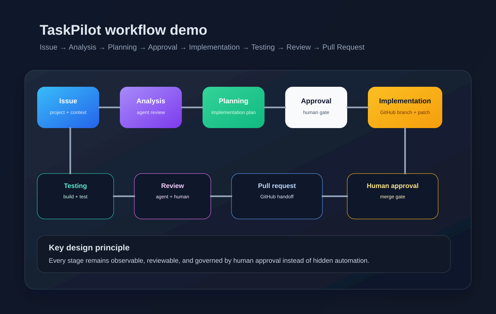

# TaskPilot

TaskPilot is an AI-native project and issue tracking platform built with Laravel and React. It combines classic issue-management workflows with agent-driven analysis, planning, review, and GitHub-aware coordination so an issue can move from triage to implementation and pull-request visibility without losing human oversight.

## Why TaskPilot exists

The product started as a Jira-style project tracker, but it is intentionally designed to evolve into a workflow system for software development teams that want AI assistance to be visible, reviewable, and governed by human approval.

The core idea is simple:

- issues are the source of work,
- agents analyze and plan against that context,
- workflow stages create approval gates,
- repository integration keeps the work connected to real code changes,
- humans stay in control of consequential actions.

## Current capabilities

TaskPilot already includes:

- project creation and project membership
- issue creation, management, labels, comments, and assignment
- workflow status tracking and an issue lifecycle model
- Kanban-style project flow
- AI agent definitions and execution history
- issue analysis and planning prompts grounded in current issue context
- approval-gated workflow progression
- GitHub repository linking, branch creation, and pull-request status summaries
- realtime workflow updates through Laravel Reverb

## Portfolio story

This repository is intentionally presented as a portfolio-grade demonstration of an AI-native development workflow rather than a generic issue tracker.

The narrative is simple: a team starts with a normal project and issue management workflow, then layers in analysis, planning, implementation, testing, review, and repository-aware delivery. Every major stage is visible, reviewable, and governed by human approval so the experience feels like a realistic software workflow instead of hidden automation.

The result is a codebase that can be used to explain:

- how issue context becomes actionable engineering work,
- how AI agents are bound to project and issue lifecycle states,
- how repository operations stay behind a safe service boundary,
- how a product can evolve from backlog management into autonomous software coordination.

## Workflow overview

```text
Issue
  ↓
Analysis
  ↓
Planning
  ↓
Approval
  ↓
Implementation
  ↓
Testing
  ↓
Review
  ↓
Pull Request
  ↓
Human Approval
```

The system keeps the workflow observable and auditable at each stage instead of hiding AI work behind opaque automation.

## Workflow demo

This project is designed to communicate the full software-development lifecycle in a way that feels concrete and portfolio-ready.



The visual above shows the current product flow from issue intake to GitHub-aware implementation and review. It is intended to demonstrate how a normal project issue can become a structured plan, a branch-based implementation, and a reviewable pull request while keeping human approval in the loop for consequential actions.

## Product narrative

TaskPilot is intended to look and feel like a realistic engineering workflow rather than a toy automation demo. The app starts with issue management, adds AI analysis and planning, then moves into an approval-gated implementation path connected to a real GitHub repository. The result is a system that can explain how software work moves from a problem statement into a reviewable engineering delivery flow with traceability at each step.

## Tech stack

### Backend

- Laravel 12 / PHP 8.5
- MySQL
- Redis
- Laravel Queues
- Laravel Reverb
- GitHub API integration layer

### Frontend

- React
- TypeScript
- Vite
- Tailwind CSS
- Inertia.js-style server-driven pages

### Quality and validation

- PHPUnit / Pest
- Vitest
- GitHub Actions CI

## Repository structure

```text
app/                 Laravel application code
bootstrap/           framework bootstrap
config/              app configuration
database/            migrations, factories, seeders
docs/                product, architecture, and roadmap docs
public/              public web assets
resources/           frontend, CSS, and view templates
routes/              HTTP routes
tests/               PHP and frontend test coverage
```

## Local development

### Prerequisites

- Docker Desktop or Docker Engine
- Node.js 22+
- Composer

### Start the app

```bash
cp .env.example .env
composer install
npm install
./vendor/bin/sail up -d
./vendor/bin/sail artisan key:generate
./vendor/bin/sail artisan migrate
```

### Run the frontend in development mode

```bash
npm run dev
```

### Demo data / portfolio preview

Run the default seeders to create a realistic project with issue workflow states, GitHub repository metadata, and sample agent progress:

```bash
./vendor/bin/sail artisan migrate:fresh --seed
```

This creates a default portfolio-ready project and seeded issue history so the app is immediately usable for demoing the analysis, planning, implementation, and review flow without manual setup.

### Run tests

```bash
./vendor/bin/sail test
npx vitest run
```

### Build assets

```bash
npm run build
```

### Realtime services

The app uses Laravel Reverb and a queue worker for realtime workflow updates:

```bash
./vendor/bin/sail restart queue reverb
```

### Docker setup

TaskPilot includes a Laravel Sail-based Docker stack for local development and portfolio demos. The full runtime layout, startup steps, and default ports are documented in [docs/docker-setup.md](docs/docker-setup.md).

### Security review

The current security posture and review notes are documented in [docs/security-review.md](docs/security-review.md). This includes the project’s auth boundaries, approval flow, secret handling strategy, and the main operational risks to watch as the platform evolves.

### Performance review

The current performance posture and key optimization areas are documented in [docs/performance-review.md](docs/performance-review.md). The review highlights the app’s strong queue-backed workflow design, the main issue-list and relationship hotspots to monitor, and the practical optimization priorities for pagination, eager loading, minimal realtime payloads, and cached metadata.

### Agentic workflow

The end-to-end agent lifecycle and approval-driven execution model are documented in [docs/agentic-workflow.md](docs/agentic-workflow.md). This guide explains how an issue moves from analysis to planning, approval, implementation, testing, review, and final human sign-off without bypassing the project’s governance checks.

## GitHub integration

TaskPilot can be connected to a GitHub repository at the project level. The integration is intentionally isolated behind a service boundary so the rest of the app does not depend directly on GitHub client calls.

This supports:

- repository connection metadata
- branch creation from the configured default branch
- issue-to-branch mapping
- pull request status summaries
- review and approval context for the current workflow

## Roadmap status

This repository is currently at the Phase 12 hardening handoff stage:

- project and issue management are established,
- AI analysis and planning flow is working,
- workflow approval and implementation transitions are in place,
- GitHub-aware branch and PR status are integrated,
- the remaining work is product polish, onboarding clarity, and public presentation.

## License

This project is currently distributed as a repository-first portfolio application and is intended for local development and showcasing the product direction.

## Contributing

This repository is intended to demonstrate an evolving engineering workflow, so contribution and iteration are welcome as long as the existing architecture and phase boundaries are respected.
