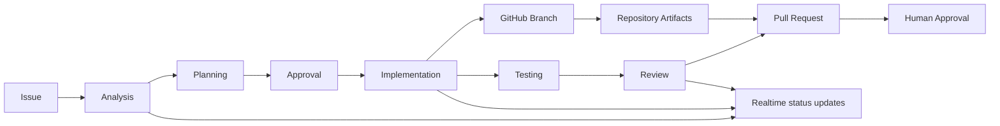

# TaskPilot — Architecture

## 1. Architectural Overview

TaskPilot is a Laravel/React application designed around a domain-oriented backend and a reactive frontend.

The public-facing architecture mirrors the current product story: an issue moves through analysis, planning, approval, implementation, testing, review, and pull request creation while preserving human oversight at each consequential step.

The initial architecture is:

```text
React SPA
    │
    │ REST / JSON
    ▼
Laravel API
    │
    ├── Controllers
    ├── Form Requests
    ├── Services
    ├── Repositories
    ├── Domain Events
    └── Policies
    │
    ▼
MySQL
    │
    └── Redis
          │
          ├── Cache
          └── Queues
```

The current implementation narrows the architecture to a realistic software workflow that can be presented publicly:



The visual product flow is also represented in the public portfolio assets, as shown in the workflow diagram below:


Future agentic functionality extends the architecture:

```text
React
   │
   ▼
Laravel API
   │
   ▼
Domain Services
   │
   ├── Workflow Engine
   ├── Event System
   └── Agent Orchestrator
             │
             ▼
        Laravel Queue
             │
       ┌─────┼─────┐
       ▼     ▼     ▼
    Agents  GitHub  AI Providers
```

---

## 2. AI Provider Abstraction and Copilot Integration

TaskPilot must not talk directly to a specific AI provider from business logic or UI layers. Instead, the system should define a provider abstraction that accepts a standard request contract and returns a normalized response model.

This keeps the dominant domain concerns stable while allowing different providers to be introduced over time.

### Provider Contract

The abstraction should standardize:

* model selection
* request payload formatting
* prompt assembly from issue context
* response parsing and validation
* provider-side error handling
* retry and timeout policy
* structured logging and audit metadata

### Copilot Adapter

GitHub Copilot is the first concrete provider integration to implement. The Copilot adapter should sit behind the provider interface and be responsible for:

* translating TaskPilot agent runs into provider-specific requests
* attaching the correct system prompt and issue context
* handling provider authentication and configuration on the server side
* normalizing the provider response into TaskPilot agent messages and run status updates
* reporting provider failures without exposing credentials or sensitive request details

### Execution Flow

```text
Issue
  ↓
Agent Run
  ↓
Agent Orchestrator
  ↓
Provider Adapter (Copilot)
  ↓
Queue / Async Worker
  ↓
Provider API
  ↓
Normalized Result
  ↓
Agent Message + Status Update + Issue Activity
```

### Security and Operational Boundaries

All provider credentials must remain server-side. AI output must be treated as untrusted input, validated before it is used to update workflow state, and kept within the same authorization and audit boundaries as all other issue activity.

This includes:

* no provider credentials in the browser
* no provider secrets in issue content or comments
* no agent output bypassing approval gates for consequential actions
* explicit logging for request failures, rate limits, and timeouts

### Scope

This layer is intentionally limited to issue analysis and planning support. The first Copilot-backed capability should expand the agent foundation without enabling autonomous coding or unsupervised repository mutation.

---

## 3. Technology Stack

### Backend

* Laravel
* PHP
* MySQL
* Redis
* Laravel Queues
* Laravel Events
* Laravel Reverb
* Laravel Sanctum

### Frontend

* React
* TypeScript where appropriate
* React Router
* TanStack Query
* Zustand where shared client state is required
* Tailwind CSS

### Testing

* PHPUnit/Pest
* Vitest
* React component tests

### Infrastructure

* Docker / Laravel Sail
* GitHub Actions
* GitHub repository integration as part of the active product workflow

---

## 4. Backend Layering

The backend must maintain clear boundaries.

```text
HTTP
 │
 ▼
Controller
 │
 ▼
Form Request
 │
 ▼
Service
 │
 ▼
Repository
 │
 ▼
Database
```

Domain events and asynchronous operations should be introduced where appropriate:

```text
Service
 │
 ├── Database operation
 │
 └── Domain Event
        │
        ▼
      Listener
        │
        ▼
      Queue
```

Controllers must remain thin.

Business rules belong in services.

Database access belongs in repositories.

HTTP concerns must not leak into domain or persistence layers.

---

## 5. Core Domain Entities

The initial domain should include:

```text
User
Project
ProjectMember

Issue
IssueType
IssueStatus
IssuePriority

Comment
Label
IssueLabel

IssueActivity

AgentDefinition
AgentRun
AgentMessage
```

Future entities may include:

```text
Workflow
WorkflowStep
WorkflowRun

Repository
Branch
PullRequest

AgentTool
AgentTask
AgentApproval
```

---

## 5. Issue Model

An issue should contain at least:

```text
id
project_id
issue_key
title
description

type
status
priority

reporter_id
assignee_id
parent_issue_id

story_points

created_at
updated_at
closed_at
```

Issue state values should use typed enums rather than scattered string constants.

Issue identifiers should be project-scoped.

Example:

```text
TASK-142
```

The numeric sequence must be concurrency-safe.

---

## 6. Project Model

A project should contain:

```text
id
name
key
description
```

Projects own:

* Issues
* Members
* Workflow configuration
* Future agent configuration

The project key is used when generating human-readable issue identifiers.

---

## 7. Workflow Architecture

Workflow states must be data-driven.

Initial states:

```text
Backlog
Todo
In Progress
Review
Done
```

Avoid hard-coded behavior based on state names when a data-driven configuration can represent the same behavior.

Future architecture:

```text
Workflow
   │
   ├── WorkflowStep
   │
   └── WorkflowTransition
```

This allows different projects to use different workflows.

---

## 8. Event-Driven Design

Important domain events should be represented explicitly.

Examples:

```text
IssueCreated
IssueUpdated
IssueAssigned
IssueStatusChanged
CommentAdded

AgentRunStarted
AgentRunCompleted
AgentRunFailed

PullRequestCreated
TestsCompleted
CodeReviewCompleted
```

Events should be used where they improve decoupling and asynchronous processing.

Do not introduce events merely for abstraction.

---

## 9. Queue Architecture

Long-running or external operations must not block HTTP requests.

Examples:

* AI requests
* Agent execution
* Notifications
* Repository operations
* Test execution
* Pull request operations

The architecture should be:

```text
HTTP Request
    │
    ▼
Service
    │
    ▼
Dispatch Job
    │
    ▼
Redis Queue
    │
    ▼
Worker
```

Agent execution must be asynchronous.

---

## 10. Agent Architecture

Agents must not be tightly coupled to a specific AI provider.

Conceptually:

```text
Agent Orchestrator
       │
       ▼
Agent
       │
       ▼
AI Provider Interface
       │
       ├── Provider A
       ├── Provider B
       └── Provider C
```

Provider-specific SDKs must remain behind the provider abstraction.

The issue domain must not know which AI provider or model is being used.

---

## 11. Agent Run Model

Each agent execution must be represented by an AgentRun.

Conceptual structure:

```text
agent_runs

id
issue_id
agent_id

status

input
output
error

model
provider

started_at
completed_at

tokens_used
```

The purpose is observability and traceability.

Users should be able to inspect agent activity for an issue.

---

## 12. Agent Orchestration

The future orchestrator should coordinate workflows rather than embedding workflow logic in individual agents.

Example:

```text
Workflow
   │
   ▼
Analyzer Agent
   │
   ▼
Planning Agent
   │
   ▼
Implementation Agent
   │
   ▼
Testing Agent
   │
   ▼
Review Agent
```

The orchestrator determines:

* Which agent runs
* What input it receives
* When it runs
* What happens on success
* What happens on failure
* Whether human approval is required

---

## 13. GitHub Integration

GitHub integration is a later phase.

The intended architecture is:

```text
Issue
  │
  ▼
Implementation Agent
  │
  ├── Create branch
  ├── Modify files
  ├── Run tests
  ├── Commit
  ├── Push
  └── Create PR
```

Repository operations should be isolated behind a dedicated integration service.

GitHub-specific API logic must not be placed in controllers or issue services.

---

## 14. Realtime Architecture

Laravel Reverb may be used for realtime updates.

Future flow:

```text
Agent Worker
    │
    ▼
AgentRunUpdated
    │
    ▼
Broadcast
    │
    ▼
Laravel Reverb
    │
    ▼
React
```

This allows the UI to display live agent progress as changes arrive through the Reverb event stream.

---

## 15. Frontend Architecture

React should be organized around reusable, focused components.

Conceptually:

```text
Pages
 │
 ├── Dashboard
 ├── Project
 ├── Board
 ├── Issues
 └── Issue Detail
       │
       ├── IssueHeader
       ├── IssueDescription
       ├── IssueMetadata
       ├── Comments
       ├── ActivityTimeline
       └── AgentWorkflow
```

Pages should compose components rather than contain all UI logic themselves.

The frontend must follow the mobile-first requirements defined in the repository coding rules.

---

## 16. API Architecture

The backend exposes REST APIs.

Responses should follow the repository's standard response envelope rules.

Examples:

```json
{
  "issue": {}
}
```

and:

```json
{
  "issues": []
}
```

Errors should use the standardized application error envelope.

Authentication and resource authorization must be enforced on protected endpoints.

---

## 17. Security

All mutation operations require authentication.

Resource access must verify project membership or ownership.

AI operations must not bypass normal authorization.

Repository and GitHub credentials must never be stored in issue descriptions, agent messages, logs, or client-side state.

Sensitive credentials must remain server-side.

Agent output must be treated as untrusted input.

---

## 18. Architectural Principle

Future agentic functionality should be added as extensions to the existing domain rather than creating a parallel application architecture.

The Issue remains the fundamental unit of work.

Agents operate on issues through application services and workflows.

Human and AI development workflows should use the same underlying system of record.
